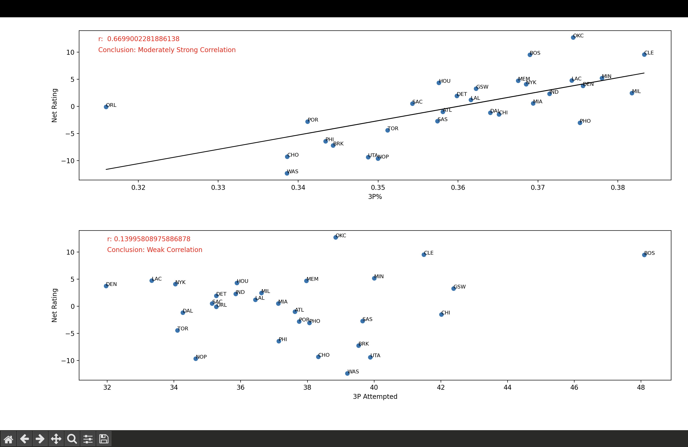
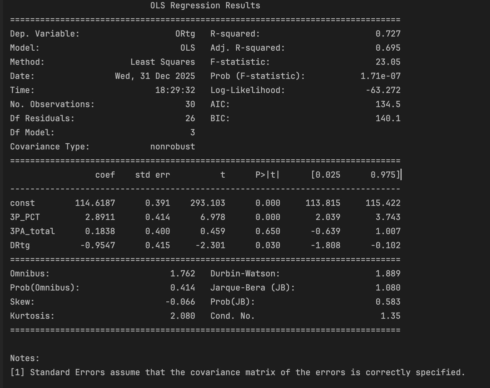
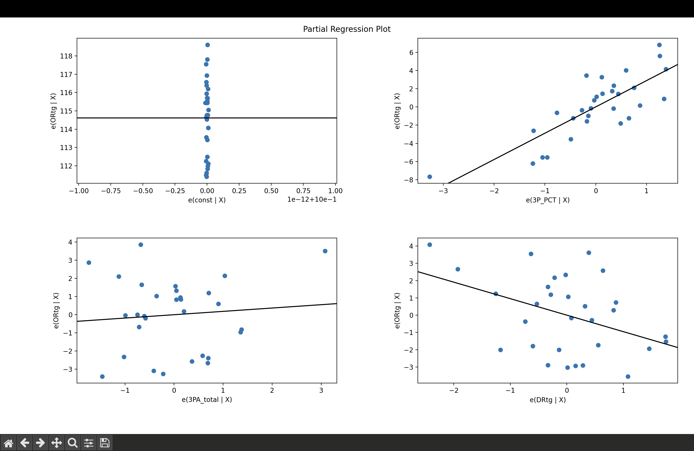

# NBA 3-Point Efficiency vs Volume Analysis (2024–2025)

## Overview
This project analyzes whether NBA team success during the 2024–2025 season is more strongly associated with **three-point shooting efficiency** or **three-point shooting volume**. Team performance is evaluated using **Net Rating (NRtg)** and **Offensive Rating (ORtg)**, both possession-adjusted metrics commonly used in basketball analytics.

The analysis is structured in two stages:
1. **Exploratory correlation analysis**
2. **Controlled multivariate regression analysis**

---

## Data
All data used in this project was sourced from **Basketball-Reference**.

**Player-level data**
- Shooting statistics (3P, 3PA, 3P%)
- Games played
- Team assignments

**Team-level data**
- Offensive Rating (ORtg)
- Defensive Rating (DRtg)
- Net Rating (NRtg)
- Wins, losses, league rankings

### Trade Adjustment
Mid-season trades are explicitly handled by removing aggregate rows (e.g. `2TM`, `3TM`) and scaling player shooting contributions by games played. This prevents double-counting players who appeared on multiple teams during the season.

---

## Methodology

### Data Processing
- Cleaned player data to remove trade aggregates
- Mapped player statistics to team abbreviations
- Converted player shooting stats into **season-scaled team contributions**
- Aggregated three-point makes and attempts at the team level
- Computed team-level three-point percentage (3P%)

---

## Part I — Exploratory Analysis

### Approach
- Computed Pearson correlations between:
  - **3P% vs Net Rating**
  - **3PA vs Net Rating**
- Visualized relationships using scatter plots with linear regression lines
- Annotated team-level outliers

### Results
- **3P% vs Net Rating:** r ≈ **0.67** (moderately strong correlation)
- **3PA vs Net Rating:** r ≈ **0.14** (weak correlation)

### Visualization

### Interpretation
The exploratory analysis indicates that three-point shooting efficiency is substantially more correlated with team success than raw three-point attempt volume.

---

## Part II — Controlled Regression Analysis

### Motivation
Because offensive performance is influenced by multiple interacting factors, a controlled analysis was conducted to test whether **three-point efficiency remains predictive after accounting for confounders**, particularly defensive strength.

### Model Specification
A standardized **Ordinary Least Squares (OLS)** regression was estimated with:

**Dependent variable**
- Offensive Rating (ORtg)

**Independent variables**
- Three-point percentage (3P%)
- Three-point attempt volume (3PA)
- Defensive Rating (DRtg)

All predictors were **z-score standardized** prior to estimation to improve interpretability and reduce numerical instability.

---

## Regression Results

### Coefficient Table

### Visualization (Controlled Relationship)

### Key Findings
- **3P%** remains a strong, statistically significant predictor of offensive performance  
  - β ≈ **2.89**, p < **0.001**
- **3PA** is not statistically significant after controls  
  - p ≈ **0.65**
- **DRtg** is negatively associated with ORtg, as expected  
  - p ≈ **0.03**
- The model explains approximately **73% of the variance** in team offensive rating (R² ≈ 0.73)

---

## Notable Observations
- Boston appears as a **high-volume outlier**, performing well without elite three-point efficiency
- This suggests that extreme shot volume can partially compensate for non-elite efficiency, though this effect is not consistent across teams
- Teams with poor efficiency generally do not achieve strong offensive ratings, even with higher attempt volume

---

## Tools Used
- **Python**
- **Pandas**
- **NumPy**
- **Matplotlib**
- **statsmodels**

---

## Conclusion
During the 2024–2025 NBA season, **three-point shooting efficiency is a substantially stronger driver of team success than three-point volume**, both in simple correlation analysis and after controlling for defensive performance. While high shot volume can occasionally offset lower efficiency, efficiency remains the dominant factor at the league level.

---

## Limitations & Future Work
- Analysis is limited to a single season (n = 30 teams)
- Additional offensive variables (e.g. shot distribution, turnover rate) could further refine the model
- Extending the analysis across multiple seasons would improve robustness
